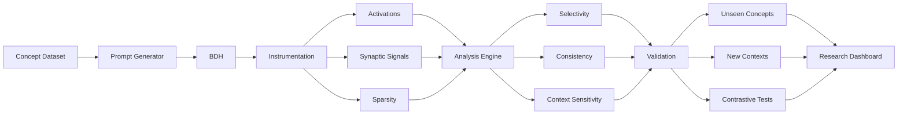

# Synapse of Dragon

### An Interactive Framework for Discovering and Validating Concept-Selective Behavior in Dragon Hatchling (BDH)

Synapse of Dragon is a research and evaluation framework designed to investigate **concept-selective internal behavior in Dragon Hatchling (BDH)**.

The project aims to move beyond simply observing model outputs and instead study whether specific internal units exhibit consistent responses to meaningful concepts.

---

## Problem

Modern AI models can perform increasingly complex tasks, but understanding what their internal components represent remains difficult.

BDH is particularly interesting because its architecture uses sparse internal activity and has reported evidence of concept-selective and monosemantic behavior.

However, an important research question remains:

> **Can we systematically discover internal units that are selective for a concept, and verify whether that selectivity generalizes beyond the examples used to discover them?**

For example, if an internal unit activates strongly for:

```text
dollar
euro
rupee
yen
```

does it represent the broader concept of **currency**, or is it simply responding to particular words or contexts?

Synapse of Dragon is designed to investigate this distinction.

---

# Proposed Solution

Synapse of Dragon provides an experimental pipeline for:

1. Creating controlled concept datasets.
2. Generating positive, negative, contrastive, and contextual prompts.
3. Running those prompts through BDH.
4. Capturing relevant internal signals from the model.
5. Measuring concept selectivity and sparse activity.
6. Discovering candidate concept-selective units.
7. Validating candidates on unseen concepts and contexts.
8. Visualizing the resulting internal behavior.

### Core pipeline

```text
Concept Dataset
       ↓
Prompt Generation
       ↓
BDH Inference
       ↓
Internal Signal Capture
       ↓
Selectivity Analysis
       ↓
Candidate Discovery
       ↓
Unseen-Concept Validation
       ↓
Context Validation
       ↓
Interactive Visualization
```

---

# Research Question

### Primary Question

> **Can internal BDH units that appear concept-selective be automatically discovered and validated for generalization across unseen concepts and contexts?**

### Secondary Questions

* Do candidate units respond to concepts rather than individual lexical tokens?
* Does concept selectivity remain consistent across different examples?
* How does contextual variation affect internal representations?
* How does sparse activity relate to concept selectivity?
* Can apparent concept selectivity be distinguished from simple lexical correlation?

---

# Experimental Methodology

## 1. Concept Dataset

We construct controlled datasets containing several categories of examples.

### Positive examples

Examples representing the target concept.

```text
Concept: Currency

Dollar
Euro
Rupee
Yen
```

### Contrast examples

Examples representing unrelated concepts.

```text
Football
Mountain
Computer
Weather
Animal
```

### Unseen examples

Examples withheld during candidate discovery.

```text
Pound
Peso
Won
Franc
```

The separation between discovery and validation is important because it allows us to test whether apparent selectivity generalizes beyond the examples used to identify a candidate.

---

## 2. Controlled Prompt Generation

Prompts are generated under controlled conditions to reduce accidental correlations.

Experiments can vary:

* concept
* wording
* context
* distractors
* positive/negative examples
* unseen examples

This allows the same internal behavior to be tested under multiple conditions.

---

## 3. BDH Instrumentation

Prompts are executed using the public BDH implementation.

The instrumentation layer captures relevant internal signals exposed by the implementation, such as:

* activation values
* internal unit responses
* relevant synaptic signals
* activation sparsity

The exact instrumentation points and tensor definitions will be documented as implementation progresses.

---

## 4. Selectivity Analysis

For each candidate unit, Synapse of Dragon compares its response across concept-related and control examples.

The analysis considers:

* response strength
* selectivity
* consistency
* sparsity
* contextual sensitivity

Candidate units are ranked according to their measured selectivity.

---

## 5. Generalization Validation

A candidate discovered using one set of examples is evaluated on examples that were **not used during discovery**.

For example:

```text
Discovery:
    Dollar
    Euro
    Rupee
    Yen

        ↓

Candidate unit discovery

        ↓

Validation:
    Pound
    Peso
    Won
    Franc
```

If a candidate remains selective on unseen examples, this provides stronger evidence that the behavior may correspond to a broader concept rather than memorization of particular tokens.

---

## 6. Context Validation

The same concept can be evaluated across different contexts.

For example:

```text
Financial:
"The dollar strengthened against the euro."

Retail:
"The dollar store opened nearby."

Programming:
"The dollar symbol appears in the code."
```

The resulting internal responses can be compared to investigate whether units respond primarily to:

* the lexical token,
* the underlying concept,
* or the surrounding context.

---

# System Architecture



---

# Technology Stack

| Component          | Technology                     |
| ------------------ | ------------------------------ |
| Language           | Python                         |
| Model execution    | PyTorch                        |
| Model              | Pathway Dragon Hatchling (BDH) |
| Data processing    | NumPy, Pandas                  |
| Experimentation    | Python-based research scripts  |
| Visualization      | Plotly                         |
| Research interface | Streamlit                      |
| Version control    | Git / GitHub                   |

The exact stack may evolve as the BDH implementation is instrumented.

---

# Key Features

### Concept Discovery

Identify internal units that exhibit selective responses to a target concept.

### Selectivity Analysis

Quantitatively compare internal responses between concept-related and control examples.

### Unseen-Concept Validation

Test whether discovered representations generalize to examples not used during discovery.

### Context Analysis

Investigate how internal representations change when the same concept appears in different contexts.

### Sparsity Analysis

Measure and visualize the distribution of active internal units.

### Interactive Visualization

Provide researchers with:

* activation heatmaps
* candidate-unit rankings
* concept comparisons
* context comparisons
* selectivity measurements

---

# Research Contribution

Synapse of Dragon is designed to contribute an **evaluation and experimentation layer** rather than another static visualization of BDH.

The central contribution is the connection between:

```text
Internal Behavior
       ↓
Quantitative Measurement
       ↓
Candidate Discovery
       ↓
Independent Validation
```

This allows researchers to move from:

> "This unit appears to represent a concept."

toward:

> "This unit was identified under controlled conditions and independently evaluated for concept-level generalization."

---

# Established vs. Measured vs. Exploratory

A major design principle of this project is to clearly distinguish different types of claims.

### Established

Findings reported by the BDH research and other cited literature.

### Measured

Results directly obtained from Synapse of Dragon experiments.

### Exploratory

Hypotheses or interpretations suggested by observed internal behavior.

This distinction prevents experimental observations from being presented as established scientific conclusions.

---

# Expected Evaluation

Synapse of Dragon will evaluate candidate representations using several dimensions.

| Metric              | Purpose                                             |
| ------------------- | --------------------------------------------------- |
| Selectivity         | How strongly a unit distinguishes a target concept  |
| Generalization      | Whether selectivity survives unseen examples        |
| Consistency         | Whether the behavior remains stable across examples |
| Context sensitivity | How representations change across contexts          |
| Sparsity            | How concentrated internal activity is               |

The precise metric definitions will be finalized after examining the relevant tensors and internal computation of the public BDH implementation.

---

# Limitations

* The publicly available BDH implementation may expose only a subset of the full research system.
* Internal activation correlation does not establish causal importance.
* Concept datasets can introduce lexical or semantic biases.
* Small-scale experiments may not generalize to larger models.
* Apparent selectivity requires careful controls before being interpreted as semantic representation.
* Results obtained from one BDH checkpoint should not automatically be generalized to future or larger checkpoints.

---

# Future Work

Synapse of Dragon is intended to serve as a foundation for additional BDH research.

Potential extensions include:

* larger BDH checkpoints
* additional concept categories
* causal intervention experiments
* long-horizon memory experiments
* continual-learning analysis
* automated concept discovery
* comparison across different model architectures
* longitudinal analysis of internal representations

The evaluation interface will be designed so that larger BDH models can be introduced without redesigning the entire experimental framework.

---

# Project Status

**Current Status: Research Prototype / Development**

The current repository contains the project design, research methodology, and planned evaluation framework.

Implementation will proceed in stages:

```text
[1] Understand & instrument BDH
        ↓
[2] Build controlled concept datasets
        ↓
[3] Implement activation analysis
        ↓
[4] Candidate discovery
        ↓
[5] Unseen-example validation
        ↓
[6] Interactive dashboard
        ↓
[7] Experimental evaluation
```

Experimental results will be added to this repository as they become available.

---

# Reproducibility

Experiments will be configured to record:

* model/checkpoint used
* dataset version
* prompt configuration
* experiment parameters
* analysis configuration
* evaluation results

The goal is for every reported result to be reproducible from the repository.

---

